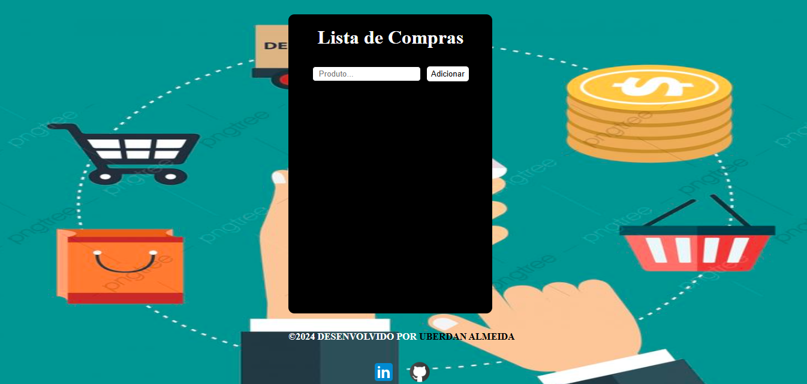

# Lista de Compras React App

Este projeto é uma aplicação React simples que permite criar e gerenciar uma lista de compras. Os usuários podem adicionar novos produtos à lista e excluir produtos existentes.

## Tecnologias Utilizadas

* **React:** Biblioteca JavaScript para construir interfaces de usuário.
* **JSX:** Extensão de sintaxe para JavaScript recomendada pelo React para descrever a aparência da interface do usuário.
* **Hooks React:** `useState` e `useRef` para gerenciar o estado e referências de elementos DOM.
* **UUID (v4):** Biblioteca para gerar IDs únicos para cada produto.
* **CSS:** Para estilização da aplicação.

## Estrutura do Projeto

* **`src/App.jsx`:** Componente principal da aplicação.
* **`src/index.css`:** Folha de estilo CSS para a aplicação.
* **`src/main.jsx`:** Ponto de entrada da aplicação React.
* **`public/imagens/lista-fundo.jfif`:** Imagem de fundo da aplicação (desktop).
* **`public/imagens/planodefundo.jpg`:** Imagem de fundo da aplicação (mobile).

## Funcionalidades

* **Adicionar Produtos:**
    * O usuário pode inserir o nome de um produto em um campo de texto.
    * Ao clicar no botão "Adicionar", o produto é adicionado à lista.
    * Um alerta é exibido se o campo de texto estiver vazio.
* **Excluir Produtos:**
    * Cada produto na lista possui um botão "❌" para exclusão.
    * Ao clicar no botão, o produto é removido da lista.
* **Interface Responsiva:**
    * A aplicação é estilizada para se adaptar a diferentes tamanhos de tela, com design diferenciado para dispositivos móveis.
* **Links para Redes Sociais:**
    * No rodapé da aplicação, há links para o LinkedIn e GitHub do desenvolvedor.
